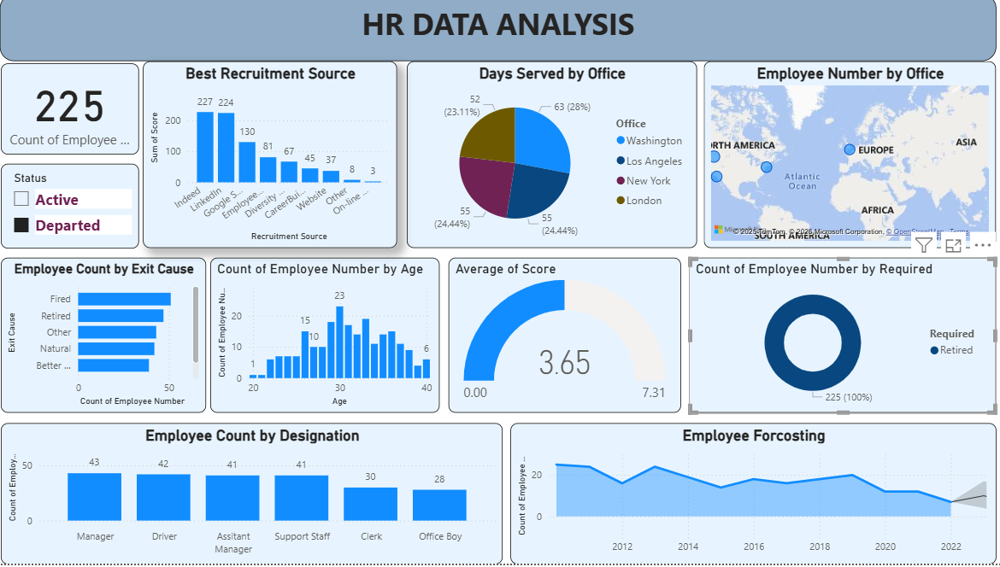

# 📊 HR Data Analysis Dashboard | Power BI

## Project Overview
This project focuses on analyzing Human Resource (HR) data to extract meaningful insights related to employee strength, recruitment effectiveness, attrition patterns, workforce demographics, and future employee trends.  
The dashboard is developed using **Microsoft Power BI** and is designed to help HR teams and management make **data-driven decisions**.

---

## Project Objective
- Analyze total employees and employment status
- Identify best recruitment sources
- Understand employee distribution across offices
- Analyze employee exit causes and attrition
- Study age-wise and designation-wise workforce
- Perform employee forecasting for future planning

---

## Tools & Technologies Used
- **Power BI** – Dashboard creation & visualization  
- **Power Query** – Data cleaning and transformation  
- **DAX (Data Analysis Expressions)** – KPIs & calculated measures  
- **Data Modeling** – Relationships & optimized schema  

---

## 📂 Data Preparation & Modeling
- Removed null and inconsistent values  
- Converted incorrect data types  
- Renamed columns for better readability  
- Built relationships between tables  
- Created DAX measures for:
  - Total Employees  
  - Active vs Departed Employees  
  - Average Employee Score  
  - Attrition & Retirement Count  

---

## 📊 Key Analysis & Insights

### 1️⃣ Employee Status Analysis
- Total employee count
- Classification into Active and Departed employees

### 2️⃣ Recruitment Source Analysis
- Compared hiring sources like LinkedIn, Indeed, Google, etc.
- Identified the most effective recruitment channel

### 3️⃣ Office-wise Employee Distribution
- Visualized employees across:
  - Washington
  - Los Angeles
  - New York
  - London

### 4️⃣ Exit Cause Analysis
- Analyzed exit reasons:
  - Retirement
  - Termination
  - Better Opportunities
  - Natural Exits

### 5️⃣ Age-wise Employee Distribution
- Identified dominant age groups
- Workforce demographic understanding

### 6️⃣ Designation-wise Employee Count
- Compared roles such as:
  - Manager
  - Assistant Manager
  - Support Staff
  - Clerk
  - Office Boy

### 7️⃣ Employee Forecasting
- Analyzed historical trends
- Predicted future workforce patterns

---

## 📈 Key KPIs
- Total Employees  
- Active vs Departed Employees  
- Average Employee Score  
- Attrition Rate  

---

## 🖼 Dashboard Preview

---

## 📁 Project Files
- `HR_Data_Analysis.pbix` – Power BI dashboard file  
- `Dashboard.png` – Dashboard screenshot  
- `project_summary.txt` – Project documentation  

---

## Business Impact
- Helps HR teams monitor workforce health  
- Improves recruitment strategy effectiveness  
- Identifies attrition drivers  
- Supports strategic workforce planning  

---

## Outcome
This project demonstrates strong hands-on skills in:
- Data Cleaning
- Data Modeling
- DAX Calculations
- Dashboard Design
- Business Analytics  

It is suitable for **Data Analyst, HR Analyst, and Business Analyst** roles.

---

## Author
**Pradeep Sharma**  
 Aspiring Data Analyst  

